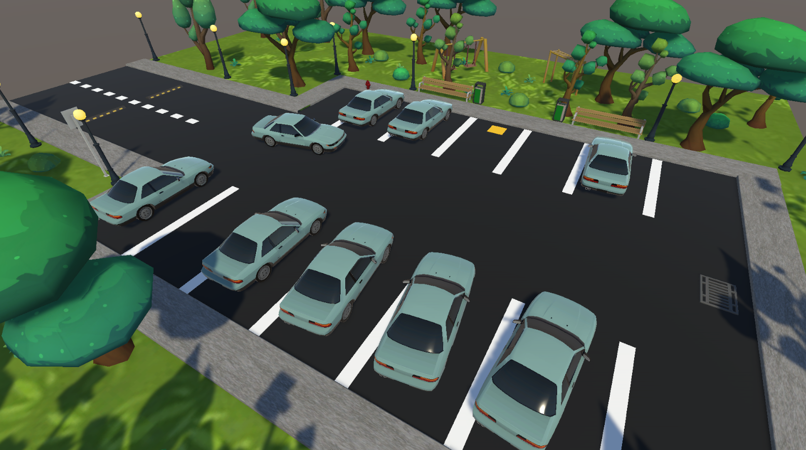
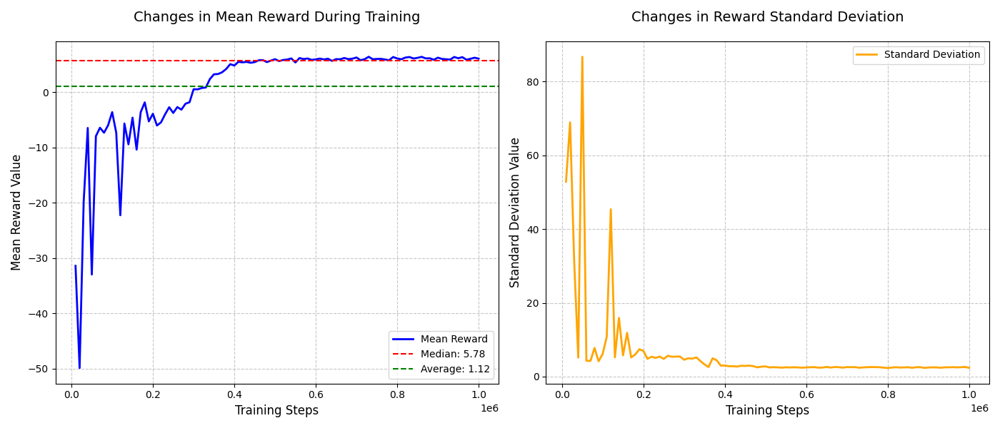

# AI Parking Assistant - Unity ML-Agents Project



An autonomous parking agent implemented using Unity ML-Agents with Proximal Policy Optimization (PPO) reinforcement learning algorithm. The agent learns to navigate to randomly assigned parking spots while avoiding collisions with other vehicles.

## Project Overview

This project demonstrates how reinforcement learning can be used to solve autonomous parking challenges. Key features:

- Dynamic parking environment with randomly placed vehicles
- Continuous action space for smooth steering control
- Carefully designed reward structure to guide learning
- PPO algorithm implementation with Unity ML-Agents
- Achieved median reward of 5.784 after 1 million training steps
- Experimental optimization with Intel OpenVINO toolkit

## Getting Started

### Prerequisites

- Unity 2021.3 or later
- Python 3.9.x (specifically tested with 3.9.13)
- Unity ML-Agents Toolkit

### Installation

1. Clone this repository:
   ```bash
   git clone https://github.com/yourusername/AI-Parking-Assistant.git
   cd AI-Parking-Assistant
   ```

2. Set up Python environment:
   ```bash
   python3.9 -m venv venv
   # On Windows:
   venv\Scripts\activate
   # On macOS/Linux:
   source venv/bin/activate

   python -m pip install --upgrade pip
   pip3 install mlagents torch torchvision torchaudio protobuf==3.20.2 onnx==1.11.0
   ```

3. Open the project in Unity and make sure all dependencies are properly imported.

### Running the Project

#### Training the Model
```bash
mlagents-learn config/moveToGoal.yaml --run-id=parking_test
```

#### Testing the Trained Model
1. In Unity Editor:
   - Select the `ParkingAgent` GameObject
   - In the Inspector, under `Behavior Parameters`:
     - Set `Behavior Type` to "Inference Only" to use the trained model
     - Set to "Heuristic Only" to control manually

2. For manual control (Heuristic mode):
   - Use arrow keys or WASD to control the vehicle
   - Horizontal axis (A/D or Left/Right) controls steering
   - Vertical axis (W/S or Up/Down) controls acceleration

## Environment Details

### Reward Function
The agent learns through a carefully designed reward structure:
- **Progress reward**: +0.5 × distance reduced to target
- **Penalty for moving away**: -0.5 × distance increased from target
- **Parking attempt bonus**: +0.2 when close (2m) and aligned (<30°)
- **Final parking reward**: +25.0 for successful parking (<1m and <15°)
- **Time penalty**: -0.002 per step to encourage efficiency
- **Collision penalty**: -1.0 for hitting obstacles
- **Reverse penalty**: -0.1 for moving backward

### Observation Space
The agent receives:
- Its position and orientation
- Target parking spot position and orientation
- Relative vector to target
- Current velocity

### Action Space
Continuous actions:
- Steering (-1 to 1, mapped to -30° to +30°)
- Acceleration (-1 to 1, mapped to reverse/full speed)

## Training Results

Pre-trained model results after 1 million steps are available in `draft/Results/`:
- Training statistics graphs
- Model checkpoints
- Performance metrics (median reward: 5.784)



Training configuration (`config/moveToGoal.yaml`):
- Batch size: 512
- Buffer size: 2048
- Learning rate: 0.0001
- Hidden units: 256 (3 layers)
- Time horizon: 128
- Gamma: 0.99

## Project Structure

```
AI-Parking-Assistant/
├── UnityProject/
│   └──Assets/            # Unity project assets
│      ├── Scripts/       # C# scripts including MoveToGoalAgent
│      └── ...            # Other Unity assets
├── config/               # Training configuration files
│   └── moveToGoal.yaml   # Main training config
├── draft/                # Documentation and results
│   └── Plans/            # Initial plans for the project
│   └── Results/          # Training results and graphs
│   └── How-to/           # Information about setup
├── OpenVINOoptimizer/    # Our attempt to optimize model for Intel CPUs with OpenVINO
└── ...                   # Other project files
```

## Contributors

- Michał Sadkowski (https://github.com/m-sadkowski)
- Michał Matysiak (https://github.com/michalmatysiak2004)

Gdańsk University of Technology, Poland

## License

This project is licensed under the MIT License - see the [LICENSE](LICENSE) file for details.

## Acknowledgments

- Unity Technologies for ML-Agents Toolkit
- PPO algorithm developers
- Reinforcement learning research community